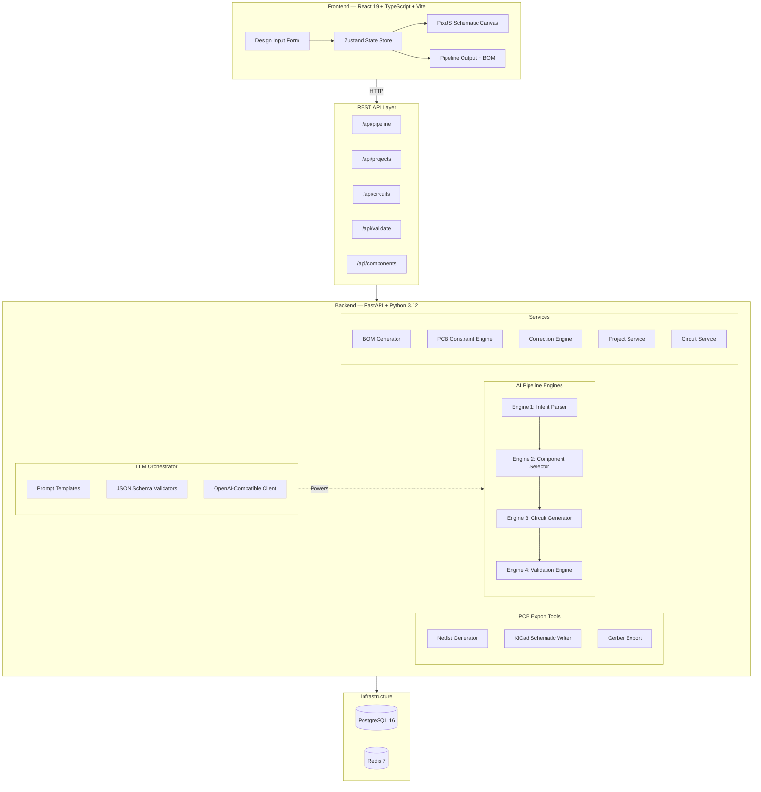
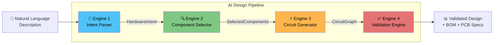
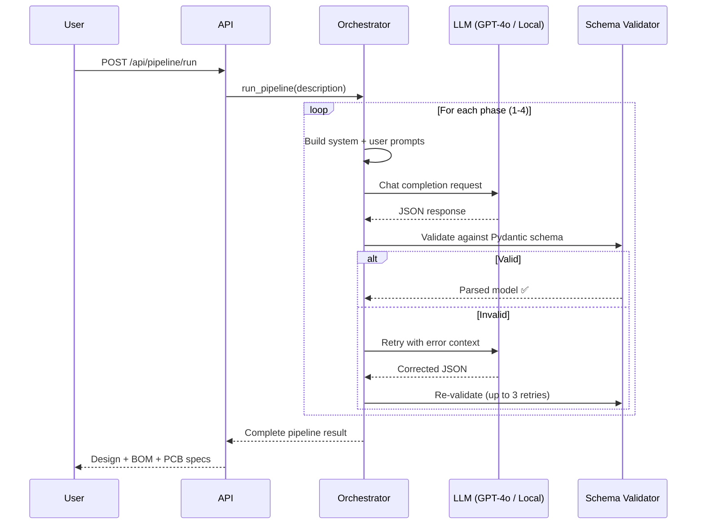
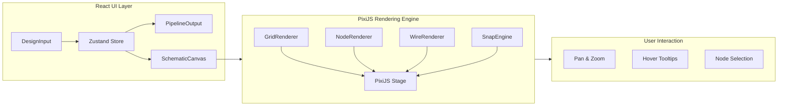
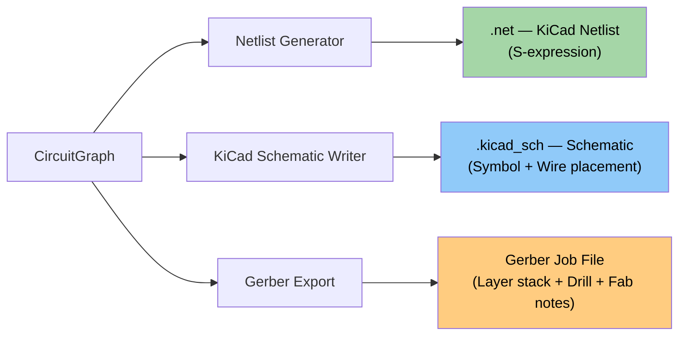

<p align="center">
  <strong>⚡ AI EDA — AI-Native Electronic Design Automation</strong>
</p>

<p align="center">
  Describe your hardware in plain English. Get a validated circuit design in seconds.
</p>

<p align="center">
  
  
  
  
  
  
  
</p>

---

## 🧠 What is AI EDA?

**AI EDA** is an AI-native Electronic Design Automation platform that transforms natural language hardware descriptions into fully validated, manufacturable circuit designs. Instead of manually selecting components and wiring them together, you simply describe what you want to build — and the AI pipeline handles the rest.

> *"I need a battery-powered outdoor weather station with temperature, humidity, and pressure sensors, WiFi connectivity, and data logging to an SD card"*

From this single sentence, AI EDA will:
- Parse your intent into structured hardware requirements
- Select real, voltage-compatible components from an approved database
- Generate a complete circuit graph with power rails, signal routing, and protection
- Validate the design against 6 electrical safety checks
- Render an interactive schematic on a WebGL canvas
- Generate KiCad-compatible netlists, schematics, and Gerber fabrication files

---

## 🏗️ System Architecture



---

## ⚙️ AI Pipeline

The core of AI EDA is a 4-engine pipeline that converts natural language into validated hardware designs. It operates in two modes: **rule-based** (deterministic, no API key needed) and **LLM-powered** (uses GPT-4o or any OpenAI-compatible model for more sophisticated parsing).



### Engine 1 — Intent Parser
Extracts structured hardware requirements from natural language. Detects sensors, actuators, connectivity (WiFi, BLE, LoRa, Zigbee, Cellular), power sources, communication protocols (I2C, SPI, UART), environmental constraints (outdoor, industrial, underwater), and device type. Supports both keyword-based NLP and LLM-powered extraction.

### Engine 2 — Component Selector
Matches parsed intent against an **approved component database** (`data/approved_components.json`). Scores MCUs by connectivity/interface compatibility, selects voltage-compatible sensors, chooses optimal regulators (lowest dropout for battery, highest capacity for mains), and auto-generates required passives (decoupling capacitors, I2C pull-up resistors) and protection circuits (reverse polarity Schottky diodes).

### Engine 3 — Circuit Generator
Builds a complete circuit graph with:
- Power rails and ground networks
- MCU ↔ sensor signal connections (I2C, SPI, analog, GPIO)
- Voltage regulator wiring with input/output rails
- Decoupling capacitor placement per IC
- Reverse polarity protection at battery input

### Engine 4 — Validation Engine
Runs **6 electrical validation checks** before the design is considered safe:

| Check | Code | Severity | Description |
|---|---|---|---|
| Voltage Compatibility | `E_VOLTAGE_MISMATCH` | Error | All nodes receive compatible voltage |
| Ground Continuity | `E_MISSING_GROUND` | Error | Every IC has a ground connection |
| Regulator Dropout | `E_DROPOUT_VIOLATION` | Error | Input voltage ≥ Vout + dropout |
| Decoupling Caps | `W_MISSING_DECOUPLING` | Warning | Every IC has a 100nF decoupling cap |
| I2C Pull-ups | `W_MISSING_PULLUP` | Warning | Pull-up resistors on SDA/SCL lines |
| GPIO Overcurrent | `W_GPIO_OVERCURRENT_RISK` | Warning | No actuators directly on GPIO pins |

### Correction Engine
When validation fails, the correction engine provides automated fix suggestions with specific component recommendations and wiring changes.

---

## 🤖 LLM Integration

AI EDA includes a full LLM orchestrator that powers each pipeline phase with structured output:



- **OpenAI-compatible**: Works with OpenAI API, Azure OpenAI, LM Studio, Ollama, vLLM, or any OpenAI-compatible proxy
- **Structured output**: JSON schemas derived from Pydantic v2 models, injected into prompts
- **Auto-retry**: Up to 3 retries with error context on schema validation failures
- **Prompt engineering**: Clean separation of prompt templates from orchestration logic

---

## 🖥️ Frontend

The frontend is built with React 19, TypeScript, and Vite, featuring a WebGL-powered schematic canvas:



- **SchematicCanvas**: WebGL-rendered circuit visualization using PixiJS 8
- **GridRenderer**: Dot-grid background with configurable spacing
- **NodeRenderer**: Component symbols with pin labels and type-based coloring
- **WireRenderer**: Orthogonal wire routing between connected pins
- **SnapEngine**: Grid-snapped positioning for precise placement
- **Zustand Store**: Lightweight reactive state management

---

## 📐 PCB Export Pipeline

AI EDA generates industry-standard output files for PCB manufacturing:



| Module | Output | Description |
|---|---|---|
| **Netlist Generator** | `.net` (KiCad 6+) | Component list with reference designators, footprints, and net connections |
| **KiCad Schematic Writer** | `.kicad_sch` | Symbol placement on grid, wire routing, power symbols (VCC/GND) |
| **Gerber Export** | Job JSON | Layer stack (F.Cu, B.Cu, mask, paste, silk, edge cuts), drill specs, board outline, fabrication notes |

---

## 🚀 Getting Started

### Prerequisites

- **Docker** & **Docker Compose** (recommended)
- Or: Python 3.12+ and Node.js 20+
- Optional: OpenAI API key (for LLM-powered mode)

### Quick Start with Docker

```bash
# Clone the repository
git clone https://github.com/anaslari23/AI-EDA.git
cd AI-EDA

# Copy environment template
cp .env.template .env

# (Optional) Add your OpenAI API key to .env
# LLM_API_KEY=sk-your-key-here

# Start all services
docker compose up --build
```

| Service   | URL                          |
|-----------|------------------------------|
| Frontend  | http://localhost:5173         |
| Backend   | http://localhost:8000         |
| API Docs  | http://localhost:8000/docs    |
| ReDoc     | http://localhost:8000/redoc   |

### Manual Setup

**Backend:**
```bash
cd backend
python -m venv venv
source venv/bin/activate   # or venv\Scripts\activate on Windows
pip install -r requirements.txt
uvicorn app.main:app --reload --port 8000
```

**Frontend:**
```bash
cd frontend
npm install
npm run dev
```

---

## 📁 Project Structure

```
AI-EDA/
├── backend/
│   ├── app/
│   │   ├── ai/                        # AI engines + LLM integration
│   │   │   ├── intent_parser.py        # Engine 1: NL → HardwareIntent
│   │   │   ├── component_selector.py   # Engine 2: Intent → Components
│   │   │   ├── circuit_generator.py    # Engine 3: Components → CircuitGraph
│   │   │   ├── orchestrator.py         # LLM orchestrator (OpenAI-compatible)
│   │   │   ├── prompts.py             # Prompt templates for all 4 phases
│   │   │   └── llm_schemas.py         # JSON schema validators
│   │   ├── validation/
│   │   │   ├── engine.py              # Engine 4: Electrical validation (6 checks)
│   │   │   └── correction.py          # Auto-fix suggestions
│   │   ├── pcb/                       # PCB export tools
│   │   │   ├── netlist_generator.py   # KiCad netlist (.net)
│   │   │   ├── kicad_writer.py        # KiCad schematic (.kicad_sch)
│   │   │   ├── gerber_export.py       # Gerber job file + fab notes
│   │   │   └── constraints.py         # PCB constraint engine
│   │   ├── schemas/                   # Pydantic v2 models
│   │   │   ├── intent.py              # HardwareIntent, DeviceConstraints
│   │   │   ├── component.py           # MCU, Sensor, Regulator, Passive
│   │   │   ├── circuit.py             # CircuitGraph, CircuitNode, CircuitEdge
│   │   │   ├── circuit_crud.py        # Circuit CRUD request/response models
│   │   │   ├── project.py             # Project CRUD models
│   │   │   ├── validation.py          # ValidationResult, ValidationError
│   │   │   ├── bom.py                 # Bill of Materials
│   │   │   └── pcb.py                 # PCB constraints
│   │   ├── routers/                   # API endpoints
│   │   │   ├── pipeline.py            # /api/pipeline — AI pipeline
│   │   │   ├── components.py          # /api/components — component DB
│   │   │   ├── project.py             # /api/projects — project CRUD
│   │   │   ├── circuit.py             # /api/circuits — circuit CRUD + generation
│   │   │   ├── validation.py          # /api/validate — validation endpoints
│   │   │   └── design.py              # /api/design — legacy
│   │   ├── services/                  # Business logic
│   │   │   ├── pipeline.py            # Pipeline orchestration
│   │   │   ├── project_service.py     # Project persistence
│   │   │   └── circuit_service.py     # Circuit persistence + pipeline integration
│   │   ├── models/                    # SQLAlchemy ORM models
│   │   │   └── project.py             # Project + Circuit DB models
│   │   ├── db/
│   │   │   └── session.py             # Async DB session + lifecycle
│   │   ├── bom/                       # BOM generation
│   │   ├── config.py                  # App settings (DB, Redis, LLM)
│   │   └── main.py                    # FastAPI app factory + lifespan
│   ├── data/
│   │   └── approved_components.json   # Component database
│   ├── tests/                         # Pytest test suite
│   ├── Dockerfile
│   └── requirements.txt
├── frontend/
│   ├── src/
│   │   ├── canvas/                    # WebGL schematic renderer
│   │   │   ├── SchematicCanvas.tsx     # Main canvas component
│   │   │   ├── renderer/
│   │   │   │   ├── GridRenderer.ts    # Dot-grid background
│   │   │   │   ├── NodeRenderer.ts    # Component symbol rendering
│   │   │   │   └── WireRenderer.ts    # Wire routing & rendering
│   │   │   ├── interaction/
│   │   │   │   └── SnapEngine.ts      # Grid-snap positioning
│   │   │   ├── utils/
│   │   │   │   ├── converter.ts       # Graph → render data conversion
│   │   │   │   └── routing.ts         # Orthogonal wire routing
│   │   │   └── types.ts              # Canvas type definitions
│   │   ├── components/                # React UI components
│   │   │   ├── DesignInput.tsx        # NL input form
│   │   │   └── PipelineOutput.tsx     # Results + BOM display
│   │   ├── store/                     # Zustand state management
│   │   │   ├── designStore.ts         # Design pipeline state
│   │   │   └── canvasStore.ts         # Canvas interaction state
│   │   ├── api/client.ts             # API client
│   │   ├── hooks/                    # Custom React hooks
│   │   ├── types/                    # TypeScript type definitions
│   │   ├── styles/index.css          # Design system + CSS
│   │   ├── App.tsx                   # Root component
│   │   └── main.tsx                  # Entry point
│   ├── Dockerfile
│   ├── package.json
│   └── vite.config.ts
├── docker-compose.yml                 # Full stack orchestration
├── .env.template                      # Environment variable template
└── README.md
```

---

## 🔌 API Reference

### AI Pipeline (Stateless)

| Method | Endpoint | Description |
|---|---|---|
| `POST` | `/api/pipeline/run` | Run full AI pipeline from NL description |
| `GET` | `/api/components/` | List approved components |
| `GET` | `/api/components/search` | Search component database |

### Project Management (CRUD)

| Method | Endpoint | Description |
|---|---|---|
| `POST` | `/api/projects/` | Create a new project |
| `GET` | `/api/projects/` | List all projects (paginated) |
| `GET` | `/api/projects/{id}` | Get project with circuits |
| `PATCH` | `/api/projects/{id}` | Update project metadata |
| `DELETE` | `/api/projects/{id}` | Delete project + all circuits |

### Circuit Management (CRUD + AI Generation)

| Method | Endpoint | Description |
|---|---|---|
| `POST` | `/api/circuits/projects/{id}/circuits` | Create empty circuit in project |
| `GET` | `/api/circuits/{id}` | Get circuit with full pipeline data |
| `PUT` | `/api/circuits/{id}/graph` | Update circuit graph (auto-revalidates) |
| `POST` | `/api/circuits/{id}/generate` | Run AI pipeline and store results |
| `GET` | `/api/circuits/projects/{id}/circuits` | List all circuits in project |
| `DELETE` | `/api/circuits/{id}` | Delete a circuit |

### Validation

| Method | Endpoint | Description |
|---|---|---|
| `POST` | `/api/validate/circuits/{id}` | Validate persisted circuit + update state |
| `POST` | `/api/validate/inline` | Validate circuit graph (stateless) |

### Health

| Method | Endpoint | Description |
|---|---|---|
| `GET` | `/health` | Service health check |

Full interactive documentation at [`/docs`](http://localhost:8000/docs) (Swagger) and [`/redoc`](http://localhost:8000/redoc).

---

## 🛠️ Tech Stack

| Layer | Technology |
|---|---|
| **Frontend** | React 19, TypeScript 5.9, Vite 7, PixiJS 8, Zustand 5 |
| **Backend** | Python 3.12, FastAPI 0.115, Pydantic v2, SQLAlchemy 2.0 (async) |
| **AI/LLM** | OpenAI API (GPT-4o-mini default), compatible with Ollama/LM Studio/vLLM |
| **Database** | PostgreSQL 16 (Alpine) |
| **Cache** | Redis 7 (Alpine) |
| **PCB Export** | KiCad 6+ netlist/schematic, Gerber job files |
| **Infrastructure** | Docker Compose, multi-container orchestration |
| **Testing** | Pytest, pytest-asyncio |

---

## 📄 Environment Variables

Copy `.env.template` to `.env` and configure:

| Variable | Default | Description |
|---|---|---|
| `BACKEND_PORT` | `8000` | Backend API port |
| `VITE_API_URL` | `http://localhost:8000` | Frontend → Backend URL |
| `POSTGRES_USER` | `ai_eda` | Database username |
| `POSTGRES_PASSWORD` | `changeme` | Database password |
| `POSTGRES_DB` | `ai_eda` | Database name |
| `REDIS_HOST` | `cache` | Redis hostname |
| `LLM_API_KEY` | `sk-placeholder` | OpenAI API key (or compatible) |
| `LLM_BASE_URL` | *(empty = OpenAI)* | Custom endpoint for local models |
| `LLM_MODEL` | `gpt-4o-mini` | Model identifier |
| `LLM_TEMPERATURE` | `0.1` | Generation temperature |
| `ENV` | `development` | Environment mode |

---

## 🧪 Running Tests

```bash
cd backend
pytest tests/ -v
```

---

## 🗺️ Roadmap

- [x] Rule-based AI pipeline (4 engines)
- [x] LLM-powered pipeline with structured output
- [x] WebGL schematic canvas with pan/zoom
- [x] KiCad netlist + schematic export
- [x] Gerber fabrication file generation
- [x] Project & circuit persistence (PostgreSQL)
- [ ] Real-time collaborative editing
- [ ] PCB layout auto-routing
- [ ] Component procurement integration (Mouser/DigiKey API)
- [ ] SPICE simulation integration
- [ ] User authentication & team workspaces
- [ ] Version history & design diffing

---

## 📜 License

This project is open source. See [LICENSE](LICENSE) for details.

---

<p align="center">
  Built with ⚡ by <a href="https://github.com/anaslari23">anaslari23</a>
</p>
