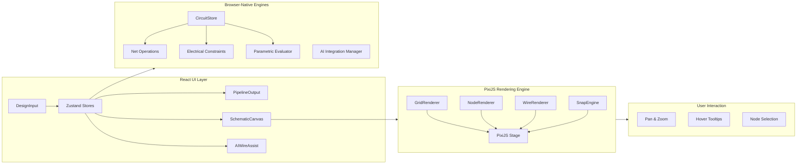

<p align="center">
  <strong>⚡ AI EDA — AI-Native Electronic Design Automation</strong>
</p>

<p align="center">
  <em>v1.1 — Browser-native validation, AI wire assist, parametric evaluation</em>
</p>

<p align="center">
  Describe your hardware in plain English. Get a validated circuit design in seconds.
</p>

<p align="center">
  
  
  
  
  
  
  
</p>

---

## 🧠 What is AI EDA?

**AI EDA** is an AI-native Electronic Design Automation platform that transforms natural language hardware descriptions into fully validated, manufacturable circuit designs. Instead of manually selecting components and wiring them together, you simply describe what you want to build — and the AI pipeline handles the rest.

> *"I need a battery-powered outdoor weather station with temperature, humidity, and pressure sensors, WiFi connectivity, and data logging to an SD card"*

From this single sentence, AI EDA will:
- Parse your intent into structured hardware requirements
- Select real, voltage-compatible components from an approved database
- Generate a complete circuit graph with power rails, signal routing, and protection
- Validate the design against 6 electrical safety checks
- Render an interactive schematic on a WebGL canvas
- Generate KiCad-compatible netlists, schematics, and Gerber fabrication files

---

## 🏗️ System Architecture

```mermaid
graph TB
    subgraph Frontend["Frontend — React 19 + TypeScript + Vite"]
        UI[Design Input Form]
        Canvas[PixiJS Schematic Canvas]
        Output[Pipeline Output + BOM]
        Store[Zustand State Stores]
        AIWire[AI Wire Assist]
        Constraints[Electrical Constraints Engine]
        Params[Parametric Evaluator]
        UI --> Store
        Store --> Canvas
        Store --> Output
        Store --> AIWire
        Store --> Constraints
        Store --> Params
    end

    subgraph API["REST API Layer"]
        Pipeline["/api/pipeline"]
        Projects["/api/projects"]
        Circuits["/api/circuits"]
        Validate["/api/validate"]
        Components["/api/components"]
    end

    subgraph Backend["Backend — FastAPI + Python 3.12"]
        subgraph AIEngines["AI Pipeline Engines"]
            E1["Engine 1: Intent Parser"]
            E2["Engine 2: Component Selector"]
            E3["Engine 3: Circuit Generator"]
        end
        subgraph LLM["LLM Orchestrator"]
            Prompts[Prompt Templates]
            Schemas[JSON Schema Validators]
            Client[OpenAI-Compatible Client]
        end
        subgraph PCBTools["PCB Export Tools"]
            Netlist[Netlist Generator]
            KiCad[KiCad Schematic Writer]
            Gerber[Gerber Export]
        end
        subgraph Services["Services"]
            BOM[BOM Generator]
            PCB[PCB Constraint Engine]
            ProjSvc[Project Service]
            CircSvc[Circuit Service]
            Alembic[DB Migrations]
        end
    end

    subgraph Infra["Infrastructure"]
        DB[(PostgreSQL 16)]
        Cache[(Redis 7)]
    end

    Frontend -->|HTTP| API
    API --> Backend
    Backend --> Infra
    E1 --> E2 --> E3 --> E4
    LLM -.->|Powers| AIEngines
```



---

## ⚙️ AI Pipeline

The core of AI EDA is a 3-engine backend pipeline that converts natural language into hardware designs, with validation now handled entirely in the browser. It operates in two modes: **rule-based** (deterministic, no API key needed) and **LLM-powered** (uses GPT-4o or any OpenAI-compatible model for more sophisticated parsing).

```mermaid
flowchart LR
    NL["📝 Natural Language\nDescription"]
    NL --> P1

    subgraph Pipeline["AI Design Pipeline"]
        direction LR
        P1["🧠 Engine 1\nIntent Parser"]
        P2["🔍 Engine 2\nComponent Selector"]
        P3["⚡ Engine 3\nCircuit Generator"]
        P4["✅ Engine 4\nValidation Engine"]
        P1 -->|HardwareIntent| P2
        P2 -->|SelectedComponents| P3
        P3 -->|CircuitGraph| P4
    end

    P4 --> Out["📊 Validated Design\n+ BOM + PCB Specs"]

    style P1 fill:#4fc3f7,color:#000
    style P2 fill:#81c784,color:#000
    style P3 fill:#ffb74d,color:#000
    style P4 fill:#e57373,color:#000
```



### Engine 1 — Intent Parser
Extracts structured hardware requirements from natural language. Detects sensors, actuators, connectivity (WiFi, BLE, LoRa, Zigbee, Cellular), power sources, communication protocols (I2C, SPI, UART), environmental constraints (outdoor, industrial, underwater), and device type. Supports both keyword-based NLP and LLM-powered extraction.

### Engine 2 — Component Selector
Matches parsed intent against an **approved component database** (`data/approved_components.json`). Scores MCUs by connectivity/interface compatibility, selects voltage-compatible sensors, chooses optimal regulators (lowest dropout for battery, highest capacity for mains), and auto-generates required passives (decoupling capacitors, I2C pull-up resistors) and protection circuits (reverse polarity Schottky diodes).

### Engine 3 — Circuit Generator
Builds a complete circuit graph with:
- Power rails and ground networks
- MCU ↔ sensor signal connections (I2C, SPI, analog, GPIO)
- Voltage regulator wiring with input/output rails
- Decoupling capacitor placement per IC
- Reverse polarity protection at battery input

### Browser-Native Validation (Frontend)

Validation has been moved entirely to the frontend for real-time feedback. The **Electrical Constraints Engine** (`frontend/src/engine/constraints/`) runs validation checks in-browser:

| Check | Code | Severity | Description |
|---|---|---|---|
| Voltage Compatibility | `E_VOLTAGE_MISMATCH` | Error | All nodes receive compatible voltage |
| Ground Continuity | `E_MISSING_GROUND` | Error | Every IC has a ground connection |
| Regulator Dropout | `E_DROPOUT_VIOLATION` | Error | Input voltage ≥ Vout + dropout |
| Decoupling Caps | `W_MISSING_DECOUPLING` | Warning | Every IC has a 100nF decoupling cap |
| I2C Pull-ups | `W_MISSING_PULLUP` | Warning | Pull-up resistors on SDA/SCL lines |
| GPIO Overcurrent | `W_GPIO_OVERCURRENT_RISK` | Warning | No actuators directly on GPIO pins |

### Parametric Evaluation Engine
The **Parametric Evaluator** (`frontend/src/engine/parameters/`) provides dependency-graph-based parameter evaluation, allowing component parameters to propagate through the circuit graph in real time.

### AI Wire Assist
The **AI Wire Assist** component (`frontend/src/components/AIWireAssist.tsx`) uses the AI integration manager to suggest intelligent wire routing and connections between components.

---

## 🤖 LLM Integration

AI EDA includes a full LLM orchestrator that powers each pipeline phase with structured output:


- **OpenAI-compatible**: Works with OpenAI API, Azure OpenAI, LM Studio, Ollama, vLLM, or any OpenAI-compatible proxy
- **Structured output**: JSON schemas derived from Pydantic v2 models, injected into prompts
- **Auto-retry**: Up to 3 retries with error context on schema validation failures
- **Prompt engineering**: Clean separation of prompt templates from orchestration logic

---

## 🖥️ Frontend

The frontend is built with React 19, TypeScript, and Vite, featuring a WebGL-powered schematic canvas and browser-native circuit engines:



- **SchematicCanvas**: WebGL-rendered circuit visualization using PixiJS 8
- **GridRenderer**: Dot-grid background with configurable spacing
- **NodeRenderer**: Component symbols with pin labels and type-based coloring
- **WireRenderer**: Orthogonal wire routing between connected pins
- **SnapEngine**: Grid-snapped positioning for precise placement
- **CircuitStore**: Full circuit graph state with Immer-powered immutable updates
- **Net Operations**: Net creation, merging, splitting, and voltage domain tagging
- **Electrical Constraints**: Real-time validation running in-browser
- **Parametric Evaluator**: Dependency-graph based parameter propagation
- **AI Integration Manager**: LLM-powered wire routing suggestions
- **Zustand Stores**: Modular state management (design, canvas, operations, performance)

---

## 📐 PCB Export Pipeline

AI EDA generates industry-standard output files for PCB manufacturing:


| Module | Output | Description |
|---|---|---|
| **Netlist Generator** | `.net` (KiCad 6+) | Component list with reference designators, footprints, and net connections |
| **KiCad Schematic Writer** | `.kicad_sch` | Symbol placement on grid, wire routing, power symbols (VCC/GND) |
| **Gerber Export** | Job JSON | Layer stack (F.Cu, B.Cu, mask, paste, silk, edge cuts), drill specs, board outline, fabrication notes |

---

## 🚀 Getting Started

### Prerequisites

- **Docker** & **Docker Compose** (recommended)
- Or: Python 3.12+ and Node.js 20+
- Optional: OpenAI API key (for LLM-powered mode)

### Quick Start with Docker

```bash
# Clone the repository
git clone https://github.com/anaslari23/AI-EDA.git
cd AI-EDA

# Copy environment template
cp .env.template .env

# (Optional) Add your OpenAI API key to .env
# LLM_API_KEY=sk-your-key-here

# Start all services
docker compose up --build
```

| Service   | URL                          |
|-----------|------------------------------|
| Frontend  | http://localhost:5173         |
| Backend   | http://localhost:8000         |
| API Docs  | http://localhost:8000/docs    |
| ReDoc     | http://localhost:8000/redoc   |

### Manual Setup

**Backend:**
```bash
cd backend
python -m venv venv
source venv/bin/activate   # or venv\Scripts\activate on Windows
pip install -r requirements.txt
uvicorn app.main:app --reload --port 8000
```

**Frontend:**
```bash
cd frontend
npm install
npm run dev
```

---

## 📁 Project Structure

```
AI-EDA/
├── backend/
│   ├── app/
│   │   ├── ai/                        # AI engines + LLM integration
│   │   │   ├── intent_parser.py        # Engine 1: NL → HardwareIntent
│   │   │   ├── component_selector.py   # Engine 2: Intent → Components
│   │   │   ├── circuit_generator.py    # Engine 3: Components → CircuitGraph
│   │   │   ├── orchestrator.py         # LLM orchestrator (OpenAI-compatible)
│   │   │   ├── prompts.py             # Prompt templates for all phases
│   │   │   └── llm_schemas.py         # JSON schema validators
│   │   ├── pcb/                       # PCB export tools
│   │   │   ├── netlist_generator.py   # KiCad netlist (.net)
│   │   │   ├── kicad_writer.py        # KiCad schematic (.kicad_sch)
│   │   │   ├── gerber_export.py       # Gerber job file + fab notes
│   │   │   └── constraints.py         # PCB constraint engine
│   │   ├── schemas/                   # Pydantic v2 models
│   │   │   ├── intent.py              # HardwareIntent, DeviceConstraints
│   │   │   ├── component.py           # MCU, Sensor, Regulator, Passive
│   │   │   ├── circuit.py             # CircuitGraph, CircuitNode, CircuitEdge
│   │   │   ├── circuit_crud.py        # Circuit CRUD request/response models
│   │   │   ├── project.py             # Project CRUD models
│   │   │   ├── validation.py          # ValidationResult, ValidationError
│   │   │   ├── bom.py                 # Bill of Materials
│   │   │   └── pcb.py                 # PCB constraints
│   │   ├── routers/                   # API endpoints
│   │   │   ├── pipeline.py            # /api/pipeline — AI pipeline
│   │   │   ├── components.py          # /api/components — component DB
│   │   │   ├── project.py             # /api/projects — project CRUD
│   │   │   ├── circuit.py             # /api/circuits — circuit CRUD + generation
│   │   │   └── design.py              # /api/design — legacy
│   │   ├── services/                  # Business logic
│   │   │   ├── pipeline.py            # Pipeline orchestration
│   │   │   ├── project_service.py     # Project persistence
│   │   │   └── circuit_service.py     # Circuit persistence + pipeline integration
│   │   ├── models/                    # SQLAlchemy ORM models
│   │   │   └── project.py             # Project + Circuit DB models
│   │   ├── db/
│   │   │   └── session.py             # Async DB session + lifecycle
│   │   ├── bom/                       # BOM generation
│   │   ├── config.py                  # App settings (DB, Redis, LLM)
│   │   └── main.py                    # FastAPI app factory + lifespan
│   ├── alembic/                       # Database migrations (Alembic)
│   │   ├── env.py
│   │   └── versions/
│   ├── scripts/
│   │   └── setup_postgres.sql         # PostgreSQL setup script
│   ├── alembic.ini                    # Alembic configuration
│   ├── data/
│   │   └── approved_components.json   # Component database
│   ├── tests/                         # Pytest test suite
│   ├── Dockerfile
│   └── requirements.txt
├── frontend/
│   ├── src/
│   │   ├── ai-integration/            # AI integration layer
│   │   │   ├── AIIntegrationManager.ts # LLM-powered assistance
│   │   │   ├── types.ts              # AI integration types
│   │   │   └── index.ts
│   │   ├── canvas/                    # WebGL schematic renderer
│   │   │   ├── SchematicCanvas.tsx     # Main canvas component
│   │   │   ├── renderer/
│   │   │   │   ├── GridRenderer.ts    # Dot-grid background
│   │   │   │   ├── NodeRenderer.ts    # Component symbol rendering
│   │   │   │   └── WireRenderer.ts    # Wire routing & rendering
│   │   │   ├── interaction/
│   │   │   │   └── SnapEngine.ts      # Grid-snap positioning
│   │   │   ├── utils/
│   │   │   │   ├── converter.ts       # Graph → render data conversion
│   │   │   │   └── routing.ts         # Orthogonal wire routing
│   │   │   └── types.ts              # Canvas type definitions
│   │   ├── components/                # React UI components
│   │   │   ├── DesignInput.tsx        # NL input form
│   │   │   ├── PipelineOutput.tsx     # Results + BOM display
│   │   │   └── AIWireAssist.tsx       # AI-powered wire routing UI
│   │   ├── engine/                    # Browser-native circuit engines
│   │   │   ├── ai/                    # AI diff & merge engines
│   │   │   ├── constraints/           # Electrical constraint validation
│   │   │   │   ├── electricalConstraints.ts
│   │   │   │   └── index.ts
│   │   │   ├── graph/                 # Circuit graph operations
│   │   │   │   ├── circuitStore.ts    # Full circuit state management
│   │   │   │   ├── netOperations.ts   # Net merge/split/domain tagging
│   │   │   │   └── pinValidation.ts   # Pin-level validation
│   │   │   └── parameters/            # Parametric evaluation
│   │   │       ├── dependencyGraph.ts # Parameter dependency tracking
│   │   │       ├── evaluator.ts       # Expression evaluation
│   │   │       ├── types.ts
│   │   │       └── index.ts
│   │   ├── store/                     # Zustand state management
│   │   │   ├── designStore.ts         # Design pipeline state
│   │   │   ├── canvasStore.ts         # Canvas interaction state
│   │   │   ├── operationStore.ts      # Circuit operation state
│   │   │   ├── performanceStore.ts    # Performance monitoring
│   │   │   ├── operations.ts          # Operation definitions
│   │   │   └── index.ts              # Store barrel export
│   │   ├── workers/                   # Web Worker infrastructure
│   │   │   ├── WorkerManager.ts       # Worker lifecycle management
│   │   │   ├── circuit.worker.ts      # Background circuit processing
│   │   │   ├── protocol.ts            # Worker message protocol
│   │   │   └── useWorker.ts           # React hook for workers
│   │   ├── api/client.ts             # API client
│   │   ├── hooks/                    # Custom React hooks
│   │   ├── types/                    # TypeScript type definitions
│   │   ├── styles/index.css          # Design system + CSS
│   │   ├── App.tsx                   # Root component
│   │   └── main.tsx                  # Entry point
│   ├── Dockerfile
│   ├── package.json
│   └── vite.config.ts
├── docs/                              # Architecture documentation
│   ├── ARCHITECTURE_BROWSER_NATIVE.md
│   └── DB_MIGRATIONS.md
├── docker-compose.yml                 # Full stack orchestration
├── .env.template                      # Environment variable template
└── README.md
```

---

## 🔌 API Reference

### AI Pipeline (Stateless)

| Method | Endpoint | Description |
|---|---|---|
| `POST` | `/api/pipeline/run` | Run full AI pipeline from NL description |
| `GET` | `/api/components/` | List approved components |
| `GET` | `/api/components/search` | Search component database |

### Project Management (CRUD)

| Method | Endpoint | Description |
|---|---|---|
| `POST` | `/api/projects/` | Create a new project |
| `GET` | `/api/projects/` | List all projects (paginated) |
| `GET` | `/api/projects/{id}` | Get project with circuits |
| `PATCH` | `/api/projects/{id}` | Update project metadata |
| `DELETE` | `/api/projects/{id}` | Delete project + all circuits |

### Circuit Management (CRUD + AI Generation)

| Method | Endpoint | Description |
|---|---|---|
| `POST` | `/api/circuits/projects/{id}/circuits` | Create empty circuit in project |
| `GET` | `/api/circuits/{id}` | Get circuit with full pipeline data |
| `PUT` | `/api/circuits/{id}/graph` | Update circuit graph (auto-revalidates) |
| `POST` | `/api/circuits/{id}/generate` | Run AI pipeline and store results |
| `GET` | `/api/circuits/projects/{id}/circuits` | List all circuits in project |
| `DELETE` | `/api/circuits/{id}` | Delete a circuit |

### Health

| Method | Endpoint | Description |
|---|---|---|
| `GET` | `/health` | Service health check |

> **Note:** Validation endpoints have been removed from the backend. Validation is now performed entirely in the browser via the Electrical Constraints Engine for real-time feedback.

Full interactive documentation at [`/docs`](http://localhost:8000/docs) (Swagger) and [`/redoc`](http://localhost:8000/redoc).

---

## 🛠️ Tech Stack

| Layer | Technology |
|---|---|
| **Frontend** | React 19, TypeScript 5.9, Vite 7, PixiJS 8, Zustand 5 |
| **Backend** | Python 3.12, FastAPI 0.115, Pydantic v2, SQLAlchemy 2.0 (async) |
| **AI/LLM** | OpenAI API (GPT-4o-mini default), compatible with Ollama/LM Studio/vLLM |
| **Database** | PostgreSQL 16 (Alpine) |
| **Cache** | Redis 7 (Alpine) |
| **PCB Export** | KiCad 6+ netlist/schematic, Gerber job files |
| **Infrastructure** | Docker Compose, multi-container orchestration |
| **Testing** | Pytest, pytest-asyncio |

---

## 📄 Environment Variables

Copy `.env.template` to `.env` and configure:

| Variable | Default | Description |
|---|---|---|
| `BACKEND_PORT` | `8000` | Backend API port |
| `VITE_API_URL` | `http://localhost:8000` | Frontend → Backend URL |
| `POSTGRES_USER` | `ai_eda` | Database username |
| `POSTGRES_PASSWORD` | `changeme` | Database password |
| `POSTGRES_DB` | `ai_eda` | Database name |
| `REDIS_HOST` | `cache` | Redis hostname |
| `LLM_API_KEY` | `sk-placeholder` | OpenAI API key (or compatible) |
| `LLM_BASE_URL` | *(empty = OpenAI)* | Custom endpoint for local models |
| `LLM_MODEL` | `gpt-4o-mini` | Model identifier |
| `LLM_TEMPERATURE` | `0.1` | Generation temperature |
| `ENV` | `development` | Environment mode |

---

## 🗄️ Database Migrations

AI EDA uses **Alembic** for database schema migrations:

```bash
cd backend

# Run all pending migrations
alembic upgrade head

# Create a new migration after model changes
alembic revision --autogenerate -m "describe your change"

# Check current migration status
alembic current
```

See [`docs/DB_MIGRATIONS.md`](docs/DB_MIGRATIONS.md) for detailed migration workflow.

---

## 🧪 Running Tests

```bash
cd backend
pytest tests/ -v
```

---

## 🗺️ Roadmap

- [x] Rule-based AI pipeline (3 backend engines)
- [x] LLM-powered pipeline with structured output
- [x] WebGL schematic canvas with pan/zoom
- [x] KiCad netlist + schematic export
- [x] Gerber fabrication file generation
- [x] Project & circuit persistence (PostgreSQL)
- [x] Browser-native electrical validation
- [x] Parametric evaluation engine
- [x] AI wire assist
- [x] Database migrations (Alembic)
- [x] Web Worker circuit processing
- [ ] Real-time collaborative editing
- [ ] PCB layout auto-routing
- [ ] Component procurement integration (Mouser/DigiKey API)
- [ ] SPICE simulation integration
- [ ] User authentication & team workspaces
- [ ] Version history & design diffing

---

## 📜 License

This project is open source. See [LICENSE](LICENSE) for details.

---

<p align="center">
  Built by <a href="https://github.com/anaslari23">anaslari23</a>
</p>
